# Containerization and Container Orchestration

## Basic Frontend Application With Docker and Kubernetes

### Project
You are developing a Simple Static Website(HTML and CSS) for a company's landing page.The goal is to containerize the application using DOCKER, deploy it to a kubernetes cluster and access it through Nginx.

#### Setting Up The Project
* Create a new project directory.
    * Go to Github account
    * Click create new repository
    * Name it Containerizationa and Container Orchestration
    * Initialize it with a README file
    * Click create repository

    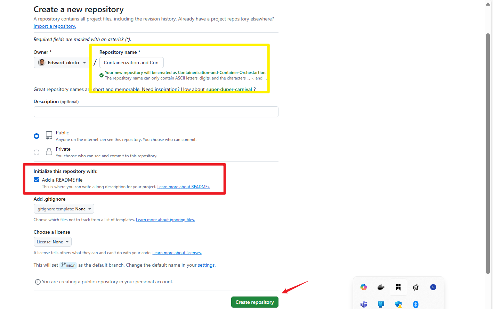

    * Copy the repository HTTP code
    
    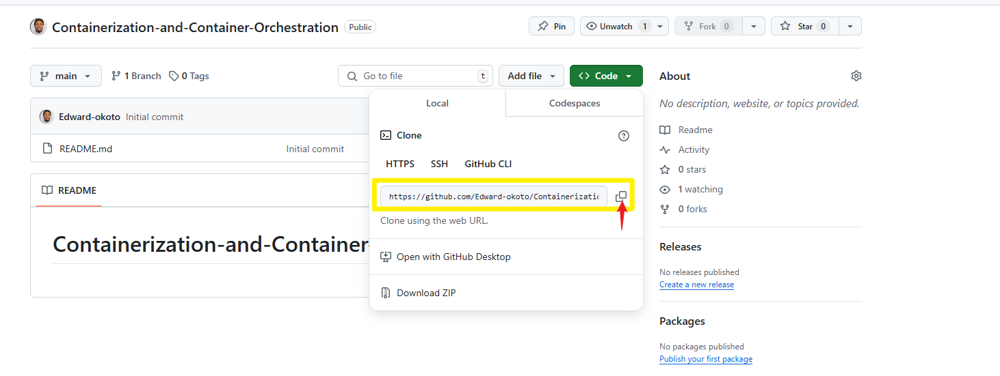

    * Clone the git repository to your local machine.

            git clone https://github.com/Edward-okoto/Containerization-and-Container-Orchestration.git

        `Git clone` is a command that creates a local copy of a remote Git repository. This allows you to work on a project from your local machine while staying in sync with the original repository.

            git clone <repository_url>


    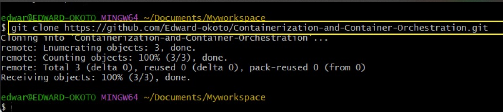


*  Inside the directory, Create an HTML (index.html) and CSS file( styles.css).

        touch index.html styles.css

    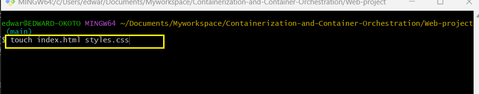


**ALTERNATIVELY**

  * Create a new project on your local machine

        mkdir MyWorkProject

    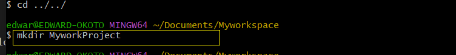

  * Inside the directory, Create an HTML (index.html) and CSS file( styles.css).
       
        touch index.html styles.css

    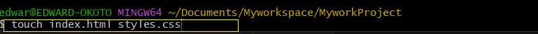

   * Proceed to initialize the repository

            git init

     `git init` is a command that initializes a new Git repository in your current directory. This creates a hidden .git directory, which stores all the metadata and version history for your project, allowing you to start tracking changes.

      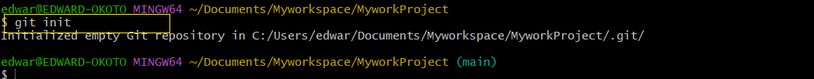

* Add and Commit the initial Code to the Git repository

        git add .

   `git add .` is a command that stages all changes (new files, modifications, deletions) in the current directory and its subdirectories for the next commit

    

    The green coloration of the files in the snippet indicates that the file have been added to the stage area and ready to be commited, otherwise it would be a red coloration which indicates the files are still in the working area and needs to be staged.

      git commit -m 'Web Project'

    `git commit` is a command that records your staged changes in the repository’s history. Each commit represents a snapshot of your project at a specific point in time, complete with a message describing the changes made.


    ```sh
    git commit -m "Your commit message"
    ```
    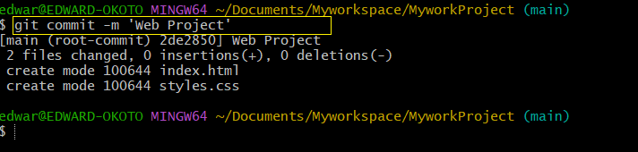


**DOCKERIZE The Application**

Refer to this link on how to install Minikube and run docker desktop
https://github.com/Edward-okoto/Setting-Up-Minikube

**Create a `Dockerfile` specifying Nginx as the base image**

 `Dockerfile` that uses Nginx as the base image:

```dockerfile
# Use the official Nginx image from Docker Hub
FROM nginx:latest

# Copy custom Nginx configuration file to the container (if you have one)
# COPY nginx.conf /etc/nginx/nginx.conf

# Copy your static website files to the container
COPY . /usr/share/nginx/html

# Expose port 80 to the outside world
EXPOSE 80

# Start Nginx
CMD ["nginx", "-g", "daemon off;"]
```

### Explanation:
- **FROM nginx:latest**: Uses the official Nginx image as the base image.
- **COPY . /usr/share/nginx/html**: Copies the content of the current directory into the Nginx document root.
- **EXPOSE 80**: Exposes port 80 to allow access to the Nginx web server.
- **CMD ["nginx", "-g", "daemon off;"]**: Keeps Nginx running in the foreground.

Save this content in a file named `Dockerfile` and use it to build your Docker image with the following command:
```sh
docker build -t my-nginx-image .
```


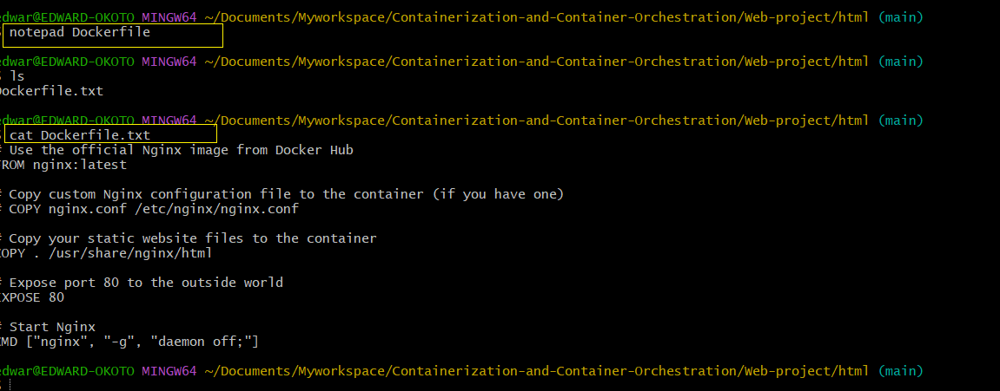

**Copy the HTML and CSS file into the Nginx html directory** 

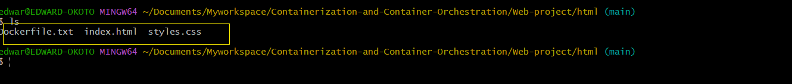

**On the directory where the Dockerfile, HTML and CSS files live in,run the docker build command**.

    docker build -t my-nginx-image .
    
The command `docker build -t my-nginx-image .` builds a Docker image from the Dockerfile in the current directory and tags it as `my-nginx-image`.

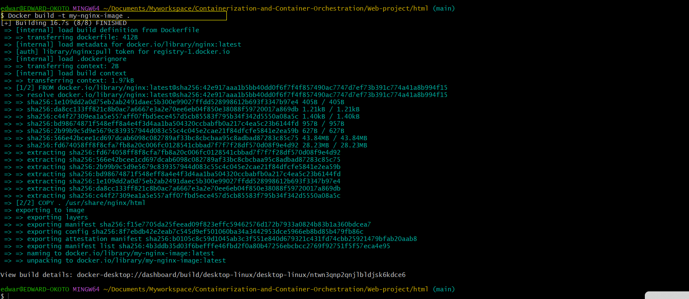

Confirm the image has been created.

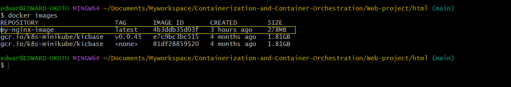

**Push to Docker Hub**

* Login to docker Hub

        docker login -u edwardokoto1

    The command `docker login -u <username>` logs you into Docker Hub or another Docker registry using the specified username.  

* Push the Docker Image to Docker Hub

        docker tag my-nginx-image edwardokoto1/nginx:1.0
    The command `docker tag` creates a new tag (alias) for an existing Docker image.

        docker push edwardokoto1/nginx:1.0

    The command `docker push` uploads a Docker image to a Docker registry, such as Docker Hub.


  ### Set Up a Kind (Kubernetes Cluster)

  * Install kind (Kubernetes in Docker)
  * Create a kind Cluster

    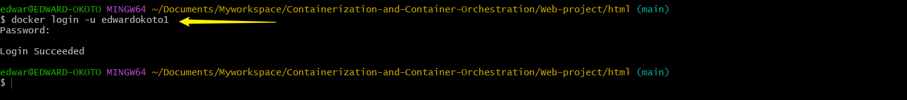


### Deploy to Kubernetes

* Create a file named **kube-nginx-deployment.yaml** and paste the content into the file
    
         apiVersion: apps/v1
         kind: Deployment
         metadata:
            name: kube-nginx-deployment
         spec:
            replicas: 1 # Number of replicas
            selector:
                matchLabels:
                app: kube-nginx
            template:
                metadata:
                    labels:
                        app: kube-nginx
                spec:
                    containers:
                    - name: kube-nginx
                      image: my-nginx-image:latest  
                      ports:
                      - containerPort: 80
      
    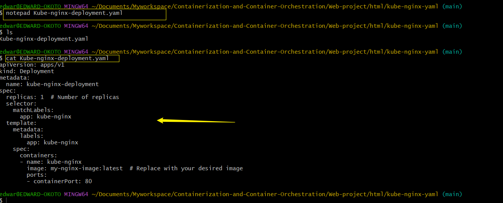
    
    #### Components Breakdown
    `apiVersion`: Specifies the version of the Kubernetes API that you’re using. In this case, it's apps/v1, indicating you're using the apps API group, version 1.

    `kind`: Defines the type of Kubernetes object you are creating. Here, it’s Deployment, which is used to manage a set of identical pods to ensure they run correctly and can be updated.

    `metadata`: Contains metadata about the object.

    `name`: The name of the Deployment, which is kube-nginx-deployment.

    `spec`: Describes the desired state of the object.

    `replicas`: Specifies the number of pod replicas to run. In this case, 1.

    `selector`: Defines how to select pods.

    `matchLabels`: Identifies the pods to manage with app: kube-nginx.

    `template`: Describes the pods that will be created.

    `metadata`: Labels for the pods.

    `labels`: Key-value pairs to categorize the pod (app: kube-nginx).

    `spec`: Specifies the pod's container settings.

    `containers`: List of containers to run.

    `name`: The name of the container, which is kube-nginx.

    `image`: The container image to use (my-nginx-image:latest).

    `ports`: List of ports to expose from the container.

    `containerPort`: The port number that the container listens on, which is 80.

* **Apply the deployment to your cluster**

        kubectl apply -f kube-nginx-deployment.yaml
    `kubectl apply` is a command used in Kubernetes to create or update resources defined in configuration files. It allows you to manage applications by applying the desired state specified in the YAML or JSON files.

  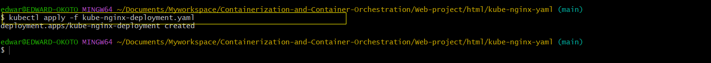

## Create A Service (ClusterIP)
* **Create a file named `kube-nginx-service.yaml`**

      

```yaml
apiVersion: v1
kind: Service
metadata:
  name: kube-nginx-service
spec:
  selector:
    app: kube-nginx
  ports:
    - protocol: TCP
      port: 80
      targetPort: 80
  type: ClusterIP
```

The provided YAML snippet defines a kubernetes Service for exposing the nginx application to the external world.

`apiVersion: v1` This specifies the API version you're using to create this resource. Here, v1 is the stable version for Service.

`kind: Service` This defines the type of resource you're creating. In this case, it's a Service.

`metadata` This section contains metadata about the resource, such as its name.
* `name: kube-nginx-service`: This is the name of your service. It should be unique within the namespace.

`spec` This section specifies the behavior and characteristics of the Service.
 * selector

   * This field is used to select the pods that will be targeted by the Service.

   * app: kube-nginx: This means the Service will target pods that have the label app: kube-nginx.

* ports

  * This defines the list of ports that the service will expose.

  * protocol: TCP: Specifies the protocol to use. In this case, it's TCP.

  * port: 80: The port that the Service will expose to the external world.

  * targetPort: 80: The port on the container to which the Service will forward traffic.

`type: NodePort` This type exposes the Service on each Node’s IP at a static port. The NodePort service will allocate a port from a range (usually 30000–32767) to expose the Service on all nodes in the cluster.

**Apply the service to your cluster**

    kubectl apply -f kube-nginx-service.yaml

`kubectl apply` is a command used in Kubernetes to create or update resources defined in configuration files. It allows you to manage applications by applying the desired state specified in the YAML or JSON files.

  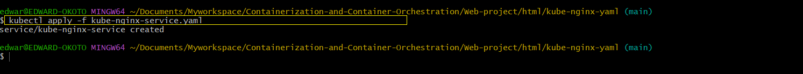

  ### Access The Application

  * Port Forward to the service to access the application locally.

        kubectl port-forward service/kube-nginx-service 8080:80
    
    This command forwards port `8080` on your local machine to port `80` on the `kube-nginx-service` in your Kubernetes cluster. You can then access the service at `http://localhost:8080`.

    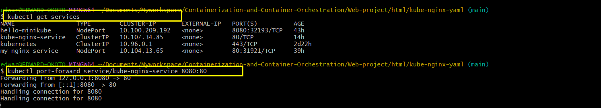

    ### **Follow these steps for port-forwarding**


    Port forwarding to a Kubernetes service allows you to access your application running inside the cluster from your local machine. 

1. **Identify the Service**: Find the name of the service you want to port forward. Use the command:
    ```bash
    kubectl get services
    ```
    This will list all the services in your cluster. Note down the name of the service and the port it's running on.

2. **Port Forward the Service**: Use the `kubectl port-forward` command to forward a port from your local machine to the service. The general syntax is:
    ```bash
    kubectl port-forward service/<service-name> <local-port>:<service-port>
    ```
    For example, if your service is named `my-service` and it's running on port `80`, you can forward it to port `8080` on your local machine using:
    ```bash
    kubectl port-forward service/my-service 8080:80
    ```

* **Access the Application**: Open your web browser and go to `http://localhost:<local-port>` (e.g., `http://localhost:8080`). You should be able to access your application running inside the Kubernetes cluster.

    Now, you can access the application by navigating to `http://localhost:8080` in your web browser.
  
    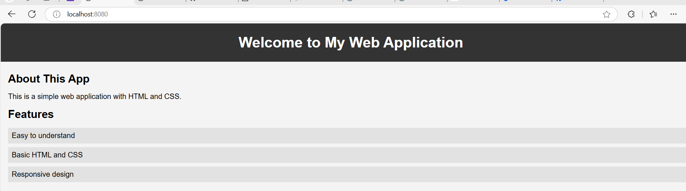

